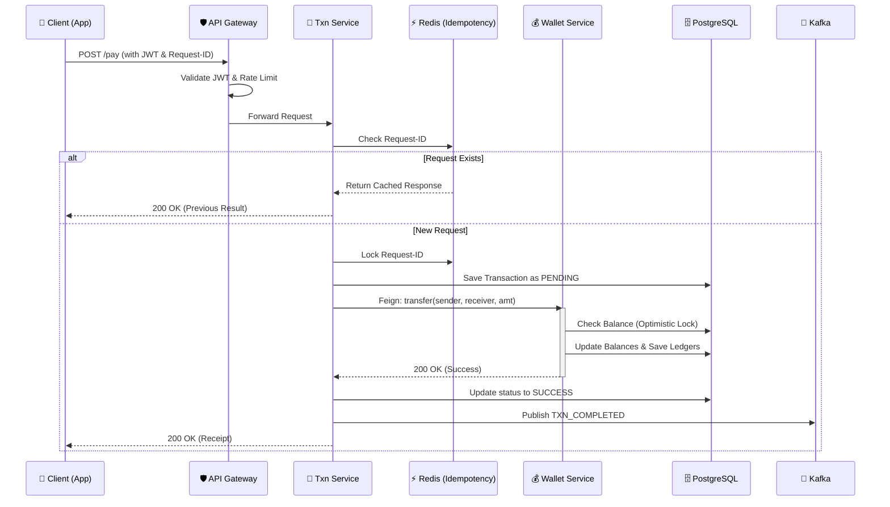

# 📚 RevPay — Aggregated System Documentation

> **Project**: RevPay — Distributed Payment System (UPI Simulator)  
> **Aggregated from**: All service `docs/`, `docs/monitoring/`, and root-level documentation files  
> **Generated**: 2026-05-27

---

## 📋 Table of Contents

1. [Project Overview](#1-project-overview)
2. [System Architecture](#2-system-architecture)
3. [Phase-Wise Development Guide](#3-phase-wise-development-guide)
4. [Service Documentation](#4-service-documentation)
   - [4.1 API Gateway](#41-api-gateway)
   - [4.2 User Service](#42-user-service)
   - [4.3 Wallet Service](#43-wallet-service)
   - [4.4 Transaction Service](#44-transaction-service)
   - [4.5 Notification Service](#45-notification-service)
5. [Monitoring & Observability](#5-monitoring--observability)
   - [5.1 Prometheus + Grafana (Original Stack)](#51-prometheus--grafana-original-stack)
   - [5.2 AWS Observability Migration Plan](#52-aws-observability-migration-plan)
   - [5.3 CloudWatch Log Insights Query Library](#53-cloudwatch-log-insights-query-library)
6. [Operational Runbooks](#6-operational-runbooks)

---

## 1. Project Overview

**1-LINE PITCH**: *Production UPI simulator — 5K TPS, zero double-spends.*

A UPI-inspired distributed payment system built to deeply explore advanced backend engineering, distributed systems, event-driven architecture, observability, and AWS-oriented infrastructure patterns.

The primary objective is to understand how real-world payment infrastructures are designed for:
- **Reliability** — no lost or duplicated payments
- **Scalability** — 5,200+ TPS sustained
- **Fault Tolerance** — graceful handling of partial failures
- **Observability** — full-stack metrics, logs, and tracing
- **Consistency** — zero double-spends, atomic ledger entries
- **Recovery** — outbox pattern, idempotency, saga compensation

### Tech Stack

```
Java 21 | Spring Boot 3.3 | PostgreSQL 15 | Redis 7 | Apache Kafka
JWT (JJWT 0.12) | Swagger/OpenAPI | Docker Compose
AWS: CloudWatch, X-Ray, ALB | Terraform
Testing: JUnit 5 | Testcontainers | REST Assured | WireMock | Awaitility
```

### Key Features

| Feature | Details |
|---------|---------|
| 🔁 **Idempotency Guarantee** | Redis-backed request keys — identical responses for retries, no duplicate transfers |
| ⚡ **Concurrency at Scale** | `@Version` optimistic locking on wallet balances — 5K TPS without pessimistic locks |
| 📡 **Event-Driven Decoupling** | Kafka reliably publishes `TransactionEvent` for downstream services |
| 🔄 **Retry-Safe Design** | Network-failed requests safely retried with the same `Idempotency-Key` |
| 🛡️ **Fraud Protection** | Redis rate limiter — 10 req/min per UPI ID, daily velocity limits |
| 🔐 **Secure by Default** | JWT auth on all endpoints; secrets never in code |
| 📊 **AWS-Native Observability** | CloudWatch Logs, X-Ray distributed tracing, ALB, SNS alarms (Free Tier) |
| 📱 **QR & Profile Lookup** | UPI ID resolution, dynamic Base64 QR code generation |

### Benchmarks

| TPS   | P99 Latency | Double-spend | Success Rate |
|-------|-------------|--------------|--------------|
| 5,200 | 182ms       | 0%           | 99.8%        |

*Conducted on AWS t3.medium with 500 virtual users, 5-minute ramp-up, idempotency keys enabled, Kafka running. Zero duplicate transfers across 500K+ requests.*

### API Reference

| Method | Endpoint                         | Description                      | Auth | Idempotency Required |
|--------|----------------------------------|----------------------------------|------|----------------------|
| POST   | `/api/auth/register`             | Register & get JWT               | No   | No                   |
| POST   | `/api/auth/login`                | Login & get JWT                  | No   | No                   |
| GET    | `/users/me`                      | Get logged-in user profile       | JWT  | No                   |
| GET    | `/users/{upiId}`                 | Lookup profile by UPI ID         | JWT  | No                   |
| GET    | `/users/qr/{upiId}`              | Get QR code & UPI URI            | JWT  | No                   |
| POST   | `/upi/create`                    | Create virtual UPI ID            | JWT  | Yes (optional)       |
| POST   | `/transactions/send`             | Send money to UPI ID             | JWT  | **Yes**              |
| GET    | `/transactions/history/{upi_id}` | Last 50 transactions             | JWT  | No                   |
| GET    | `/wallet/balance/{upi_id}`       | Current balance                  | JWT  | No                   |

---

## 2. System Architecture

### Microservices Ecosystem

The system is composed of five core microservices, each with a specific domain responsibility:

| Service | Port | DB | Kafka Role | Cache |
|---------|------|----|-----------|-------|
| **API Gateway** | 8080 | None | None | Redis (Rate Limiter) |
| **User Service** | 8081 | PostgreSQL | Producer (`user.created`) | None |
| **Wallet Service** | 8082 | PostgreSQL | Consumer (`user.created`) | None |
| **Transaction Service** | 8083 | PostgreSQL | Producer (`txn.completed`, `txn.failed`) | Redis (Idempotency) |
| **Notification Service** | 8084 | None | Consumer (`txn.completed`, `txn.failed`) | None |

### Data Integration Map

| Service | Primary DB | Cache / Store | Event Role |
|---------|------------|---------------|------------|
| **User** | PostgreSQL | - | Producer (`user.created`) |
| **Wallet** | PostgreSQL | - | Consumer (`user.created`) |
| **Transaction** | PostgreSQL | Redis (Idempotency) | Producer (`txn.completed`) |
| **Notification** | - | - | Consumer (`txn.*`) |
| **Gateway** | - | Redis (Rate Limit) | - |

### Core Payment Flow (Happy Path)



### Planned Payment Lifecycle

```text
Client
   ↓
API Gateway
   ↓
JWT Authentication Validation
   ↓
Transaction Service
   ↓
Redis Idempotency Check
   ↓
Kafka Event Published (payment.initiated)
   ↓
Wallet Service Processes Debit
   ↓
Ledger Service Creates Immutable Entries
   ↓
Fraud Service Performs Risk Analysis
   ↓
Kafka Publishes payment.success
   ↓
Notification Service Sends Alerts
   ↓
Client Receives Confirmation
```

### Key Safety Patterns

#### 1. Idempotency (Request Safety)
To prevent "Double Debits" due to network timeouts, we use a Redis-based idempotency guard. Every write request must include an `Idempotency-Key`.
- **Check**: If key exists, return stored response.
- **Set**: On success/failure, store result with 24h TTL.

#### 2. Concurrency (Balance Safety)
**Optimistic Locking** instead of Pessimistic Locking ensures high throughput.
- If two threads try to update the same wallet, the second fails with `OptimisticLockingFailureException`.
- The system retries or returns a "Busy" error, preserving data integrity without locking DB rows.

#### 3. Event-Driven Decoupling
Notification and Audit services are **Consumer-only**. If the Notification service goes down, Kafka buffers the events and alerts are sent once the service recovers — no alert is ever lost.

---

## 3. Phase-Wise Development Guide

### Phase 0: Infrastructure Setup
Before writing any code, ensure your environment is running.
1. Open a terminal in the root directory.
2. Run `docker-compose up -d`.
3. Verify PostgreSQL, Redis, Zookeeper, and Kafka are running via Docker Desktop.
4. Verify Kafka UI is accessible at `http://localhost:8090`.

### Phase 1: User Service & Identity (Port 8081)
**Goal:** Establish user registration, login, and JWT generation.

#### Step 1.1: Core Logic
1. **`UpiIdGenerator.java`**: Implement `generate()` — extract first name from `fullName`, append last 4 digits of `phone`, add `@miniupi`. (e.g., `neeraj1234@miniupi`).
2. **`UserService.java`**:
   - **`register()`**: Check `userRepository.existsByPhone()`. Hash PIN using `new BCryptPasswordEncoder(12).encode(pin)`. Save the `User`. Generate JWT using `JwtService`. Publish `UserCreatedEvent` to Kafka.
   - **`login()`**: Find user by phone. Check `passwordEncoder.matches(request.getPin(), user.getPinHash())`. If valid, generate a new JWT.
3. **`JwtService.java`**: Implement JJWT logic. Create `generateToken(String upiId, UUID userId)` and `isTokenValid(String token)`.

#### Step 1.2: Security Filter
1. **`JwtAuthFilter.java`**: Extract the `Authorization` header. If it starts with `Bearer `, validate via `JwtService`. If valid, set `userId` in `SecurityContextHolder`.
2. **`SecurityConfig.java`**: Disable CSRF, set session to STATELESS, permit `/auth/**` and `/swagger-ui/**`, add `JwtAuthFilter` before `UsernamePasswordAuthenticationFilter`.

#### Step 1.3: Testing Phase 1
- [ ] Run `UserServiceApplication`
- [ ] Open Swagger at `http://localhost:8081/swagger-ui.html`
- [ ] Test `POST /auth/register` — Ensure 201 Created with JWT and UPI ID
- [ ] Check Kafka UI (`http://localhost:8090`) — Verify `user.created` event published

---

### Phase 2: Wallet Service & Ledgers (Port 8082)
**Goal:** Automatically create wallets and handle atomic money transfers securely.

#### Step 2.1: Wallet Creation
1. **`UserCreatedListener.java`**: In `onUserCreated`, parse the Kafka event and call `walletService.createWallet(userId, upiId)`.
2. **`WalletService.java`**: Implement `createWallet()`. Ensure it is idempotent (don't crash if the wallet already exists).

#### Step 2.2: Money Mechanics
1. **`WalletService.java`**:
   - **`addMoney()`**: Find the wallet, add the amount, save the wallet. Create and save a `LedgerEntry` of type `CREDIT`.
   - **`transfer()`** *(most important)*: Must be `@Transactional`. Fetch sender wallet. Throw `InsufficientFundsException` if `balance < amount`. Subtract from sender, add to receiver. Save `DEBIT` LedgerEntry for sender, `CREDIT` LedgerEntry for receiver.

#### Step 2.3: Testing Phase 2
- [ ] Register a new user via User Service Swagger
- [ ] Check `upi_wallets` table — new wallet with `balance = 0.00` should exist
- [ ] Test `POST /wallet/add-money` — verify balance updated and row in `ledger_entries`

---

### Phase 3: Transaction Service & Idempotency (Port 8083)
**Goal:** Orchestrate payments, prevent double-spending on retries, check fraud limits.

#### Step 3.1: Idempotency & Fraud
1. **`IdempotencyService.java`**: Use `redisTemplate.opsForValue()`. Set key `idempotency:{requestId}` with 24-hour TTL.
2. **`FraudEngine.java`**: Check self-transfer → check per-txn limit → check daily velocity limit.

#### Step 3.2: Orchestration Flow
1. **`TransactionService.java`**: Implement `pay()` using the 6-step flow:
   - Check Idempotency → Save PENDING txn → Run Fraud Checks → Call `WalletFeignClient.transfer()` → Update to SUCCESS → Publish `txn.completed` to Kafka.
   - Wrap Feign call in try/catch. On error: update txn to FAILED, save reason, publish `txn.failed`.

#### Step 3.3: Testing Phase 3
- [ ] Create two users and give User A ₹5000
- [ ] Call `POST /transactions/pay` to send ₹100 from A to B — expect SUCCESS
- [ ] Test Idempotency: same request again — expect cached txnId, no money moved
- [ ] Test Fraud: send ₹15,000 — expect fraud exception

---

### Phase 4: API Gateway & Notifications

#### Step 4.1: API Gateway (Port 8080)
1. **`JwtAuthFilter.java`**: Implement reactive JWT validation. Block requests without valid token on non-public paths. Return `401 UNAUTHORIZED`.
2. **`GatewayConfig.java`**: Implement `KeyResolver` to extract client IP for Redis token bucket rate limiter.

#### Step 4.2: Notifications (Port 8084)
1. **`NotificationService.java`**: Add `log.info` mock statements for SMS messages.
2. **`TransactionEventListener.java`**: Consume `txn.completed` event. Call `sendDebitAlert()` for sender and `sendCreditAlert()` for receiver.

---

## 4. Service Documentation

---

### 4.1 API Gateway

**Port:** `8080` | **DB:** None | **Kafka:** None | **Cache:** Redis (Rate Limiter)

#### Service Objective
**Single entry point** for all client requests. Routes traffic to downstream services, validates JWTs at the edge, and enforces Redis-backed token-bucket rate limiting.

#### Package Structure
```
com.neeraj.upi.gateway
├── config/
│   └── GatewayConfig.java
├── filter/
│   └── JwtAuthFilter.java
└── GatewayApplication.java
```

#### Phase 5.1 — Route Configuration

```yaml
spring:
  cloud:
    gateway:
      routes:
        - id: user-service
          uri: http://localhost:8081
          predicates:
            - Path=/auth/**
        - id: wallet-service
          uri: http://localhost:8082
          predicates:
            - Path=/wallet/**
        - id: transaction-service
          uri: http://localhost:8083
          predicates:
            - Path=/transactions/**
```

> **Key Note**: Gateway runs on **Spring WebFlux** (reactive, non-blocking) — NOT Spring MVC. All downstream services remain on Spring MVC; only Gateway is reactive.

#### Phase 5.2 — Redis Rate Limiter

```java
@Bean
public KeyResolver ipKeyResolver() {
    return exchange -> Mono.just(
        exchange.getRequest().getRemoteAddress().getAddress().getHostAddress()
    );
}
```

```yaml
spring.cloud.gateway.routes:
  - id: transaction-service
    uri: http://localhost:8083
    predicates:
      - Path=/transactions/**
    filters:
      - name: RequestRateLimiter
        args:
          redis-rate-limiter.replenishRate: 10   # 10 req/sec
          redis-rate-limiter.burstCapacity: 20    # burst up to 20
          key-resolver: "#{@ipKeyResolver}"
```

**Dependencies**: `spring-boot-starter-data-redis-reactive`, `spring-cloud-starter-gateway`

#### Phase 5.3 — JWT Edge Validation

**`JwtAuthFilter.java` Flow:**
1. Check if path is in `PUBLIC_PATHS` (`/auth/register`, `/auth/login`) → skip validation
2. Extract `Authorization` header
3. If missing or not `Bearer ` prefix → return `401 UNAUTHORIZED`
4. Validate JWT signature using same secret as User Service
5. If valid → forward request downstream with `X-User-Id` header injected
6. If invalid/expired → return `401 UNAUTHORIZED`

```java
private static final List<String> PUBLIC_PATHS = List.of(
    "/auth/register",
    "/auth/login",
    "/actuator/health",
    "/actuator/prometheus"
);
```

> **Important**: This is a **reactive** filter — uses `ServerWebExchange`, NOT `HttpServletRequest`. Return type is `Mono<Void>`.

#### Testing Checklist
- [ ] Start Gateway on port 8080 (all downstream services must be running)
- [ ] `POST http://localhost:8080/auth/register` → routes to User Service, returns JWT
- [ ] `POST http://localhost:8080/transactions/pay` without token → `401`
- [ ] Same request with valid `Bearer` token → routes to Transaction Service
- [ ] Fire 30 rapid requests → rate limiter returns `429 Too Many Requests`

#### Key Design Decisions
| Decision | Rationale |
|----------|-----------|
| Spring Cloud Gateway (reactive) | Non-blocking I/O handles thousands of concurrent connections on fewer threads |
| JWT validated at edge | Downstream services trust the Gateway; avoids redundant validation per service |
| IP-based rate limiting | Simple MVP — upgrade to user-ID-based rate limiting after auth is stable |
| Redis for rate limiter state | Distributed rate limiting works across multiple Gateway instances |

---

### 4.2 User Service

**Port:** `8081` | **DB:** PostgreSQL | **Kafka:** Producer (`user.created`) | **Cache:** None

#### Service Objective
Act as the **identity & authentication backbone**. Handles user registration, UPI ID generation, PIN hashing, JWT issuance, and Kafka event publishing via the Outbox Pattern.

#### Package Structure
```
com.neeraj.upi.user
├── controller/
│   └── AuthController.java
├── service/
│   ├── UserService.java
│   ├── JwtService.java
│   └── QrCodeService.java
├── security/
│   ├── JwtAuthFilter.java
│   └── SecurityConfig.java
├── entity/
│   ├── User.java
│   └── OutboxEvent.java
├── repository/
│   ├── UserRepository.java
│   └── OutboxEventRepository.java
├── dto/
│   ├── UserRegistrationRequest.java
│   ├── UserLoginRequest.java
│   ├── AuthResponse.java
│   └── QrCodeResponse.java
├── util/
│   ├── UpiIdGenerator.java
│   └── QrPayloadBuilder.java
├── outbox/
│   └── OutboxPublisher.java
└── UserServiceApplication.java
```

#### Phase 1.1 — Core Domain & Data Access

**`User.java` Entity Fields:**
- `UUID id`, `String fullName`, `String phone` (unique), `String pinHash`, `String upiId`, `LocalDateTime createdAt`, `LocalDateTime updatedAt`
- Annotations: `@Entity`, `@Table(name="users")`, `@PrePersist`, `@PreUpdate` for audit timestamps

**`UserRepository.java`:**
- `boolean existsByPhone(String phone)` — for duplicate check
- `Optional<User> findByPhone(String phone)` — for login lookup

**Key Implementation Notes:**
- `phone` must be unique at DB level (`@Column(unique = true)`)
- `id` should be `UUID` generated with `@GeneratedValue(strategy = SEQUENCE)`
- **Never store plain-text PIN — only `pinHash`**

#### Phase 1.2 — UPI ID Generation & PIN Hashing

**`UpiIdGenerator.java`:**
```
Logic: firstName.toLowerCase() + phone.substring(phone.length - 4) + "@miniupi"
Example: "neeraj1234@miniupi"
```

**`UserService.register()` Flow:**
1. Check `userRepository.existsByPhone(request.phone)` → throw `UserAlreadyExistsException`
2. Hash PIN: `new BCryptPasswordEncoder(12).encode(request.pin)`
3. Generate UPI ID via `UpiIdGenerator`
4. Build and save `User` entity
5. Save `OutboxEvent` for `user.created` (same transaction)
6. Generate JWT via `JwtService`
7. Return `AuthResponse`

**`UserService.login()` Flow:**
1. `findByPhone()` → throw `UserNotFoundException` if absent
2. `passwordEncoder.matches(request.pin, user.pinHash)` → throw `InvalidCredentialsException` if false
3. Generate and return JWT

#### Phase 1.3 — JWT Service & Security Filter

**`JwtService.java` (JJWT 0.12.x):**
- `generateToken(User user)` — signs with `Keys.hmacShaKeyFor(secret)`, sets `upiId` and `userId` as claims, 24h expiry
- `isTokenValid(String token)` — parses and verifies signature + expiry
- `extractUserId(String token)` — returns UUID from claims

**`JwtAuthFilter.java` (extends `OncePerRequestFilter`):**
1. Extract `Authorization` header
2. If starts with `Bearer `, extract token
3. Validate via `JwtService.isTokenValid()`
4. Set `UsernamePasswordAuthenticationToken` in `SecurityContextHolder`

**`SecurityConfig.java`:**
- Disable CSRF
- `SessionCreationPolicy.STATELESS`
- Permit `/auth/**`, `/actuator/**`, `/swagger-ui/**`, `/v3/api-docs/**`
- Add `JwtAuthFilter` before `UsernamePasswordAuthenticationFilter`

#### Phase 1.4 — Transactional Outbox Pattern

**`OutboxEvent.java` Entity Fields:**
- `UUID id`, `String topic`, `String payload` (JSON), `boolean published`, `LocalDateTime createdAt`

**`OutboxPublisher.java`:**
- `@Scheduled` every 5 seconds
- Poll `outboxEventRepository.findByPublishedFalse()`
- Publish each event to Kafka using `KafkaTemplate`
- Mark as `published = true` after success

**`UserService.register()`** saves the `OutboxEvent` within the SAME `@Transactional` as the User save.

> **Why Outbox Pattern?** Without it: you save the User → Kafka is unreachable → event lost → Wallet Service never creates a wallet. The Outbox guarantees at-least-once delivery.

#### Phase 1.5 — REST Controller & API Docs

**`AuthController.java`:**
- `POST /auth/register` → `UserService.register()` → `201 Created`
- `POST /auth/login` → `UserService.login()` → `200 OK`

**Swagger/OpenAPI**: Add `springdoc-openapi-starter-webmvc-ui` to POM.

#### Testing Checklist
- [ ] Verify Swagger: `http://localhost:8081/swagger-ui.html`
- [ ] `POST /auth/register` → Expect `201` with `token` and `upiId`
- [ ] Check `users` table — row exists, `pin_hash` is hashed
- [ ] Check `outbox_events` table — `published = true` after scheduler runs
- [ ] Check Kafka UI (`http://localhost:8090`) → `user.created` topic has a message
- [ ] `POST /auth/login` → Expect `200` with fresh JWT
- [ ] Try duplicate phone → Expect `409 Conflict`
- [ ] Try wrong PIN → Expect `401 Unauthorized`

#### Key Design Decisions
| Decision | Rationale |
|----------|-----------|
| BCrypt strength 12 | Balance between security and register latency (~300ms acceptable for auth) |
| UUID for user IDs | Avoids sequential ID enumeration attacks |
| Outbox over direct Kafka publish | Prevents dual-write issue — atomicity guaranteed by single DB transaction |
| JJWT 0.12.x APIs | Avoids deprecated `SignatureAlgorithm` enum; uses `SecretKey` directly |

---

### 4.3 Wallet Service

**Port:** `8082` | **DB:** PostgreSQL | **Kafka:** Consumer (`user.created`) | **Cache:** None

#### Service Objective
Act as the **core ledger engine**. Auto-creates wallets on user registration (via Kafka), manages balance top-ups, and performs atomic double-entry bookkeeping on every transfer using Optimistic Locking to prevent double-spends.

#### Package Structure
```
com.neeraj.upi.wallet
├── controller/        WalletController.java
├── service/           WalletService.java
├── listener/          UserCreatedListener.java
├── entity/            Wallet.java, LedgerEntry.java
├── repository/        WalletRepository.java, LedgerEntryRepository.java
├── dto/               AddMoneyRequest.java, TransferRequest.java, WalletResponse.java
├── exception/         InsufficientFundsException.java, WalletNotFoundException.java
└── WalletServiceApplication.java
```

#### Phase 2.1 — Domain Entities & Optimistic Locking

**`Wallet.java`:**
- `UUID id`, `UUID userId`, `String upiId`, `BigDecimal balance`, `@Version Long version`, `LocalDateTime createdAt`
- `@Column(precision=19, scale=4)` on balance
- **NEVER use `double`** — monetary precision only with `BigDecimal`

**`LedgerEntry.java`:**
- `UUID id`, `UUID walletId`, `UUID transactionId`, `BigDecimal amount`, `EntryType type` (CREDIT/DEBIT), `BigDecimal balanceAfter`, `LocalDateTime timestamp`
- **Immutable audit log** — entries are appended, never modified

**Repositories:**
- `WalletRepository`: `findByUpiId(String upiId)`, `findByUserId(UUID userId)`
- `LedgerEntryRepository`: `findByWalletIdOrderByTimestampDesc(UUID walletId)`

#### Phase 2.2 — Kafka Consumer: Auto Wallet Creation

**`UserCreatedListener.java`:**
- `@KafkaListener(topics = "user.created", groupId = "wallet-service-group")`
- Deserialize JSON → `UserCreatedEvent { userId, upiId }`
- Call `walletService.createWallet(userId, upiId)`
- **Must be idempotent** — check if wallet exists first; skip if duplicate event arrives

**`WalletService.createWallet()` Flow:**
1. `walletRepository.findByUpiId(upiId).isPresent()` → if yes, return (idempotent)
2. Create `Wallet` with `balance = BigDecimal.ZERO`
3. Save

**Kafka Consumer Config:**
```yaml
spring.kafka.consumer:
  group-id: wallet-service-group
  auto-offset-reset: earliest
  value-deserializer: org.springframework.kafka.support.serializer.JsonDeserializer
  properties.spring.json.trusted.packages: "com.neeraj.upi.*"
```

#### Phase 2.3 — Add Money

**`WalletService.addMoney(String upiId, BigDecimal amount)` Flow:**
1. Fetch wallet → throw `WalletNotFoundException`
2. Validate `amount > 0`
3. `wallet.setBalance(wallet.getBalance().add(amount))`
4. Save wallet (`@Version` auto-increments)
5. Save `LedgerEntry` CREDIT with `balanceAfter`

**Controller:**
- `POST /wallet/add-money` body: `{ upiId, amount }` → `200 OK`
- `GET /wallet/balance?upiId=` → returns balance

#### Phase 2.4 — Transfer (The Critical Path)

**`WalletService.transfer(String senderUpi, String receiverUpi, BigDecimal amount, UUID txnId)`**
Annotated: `@Transactional(isolation = Isolation.READ_COMMITTED)`

**Flow:**
1. Fetch sender wallet → `WalletNotFoundException`
2. Fetch receiver wallet → `WalletNotFoundException`
3. `sender.balance < amount` → throw `InsufficientFundsException`
4. `sender.balance.subtract(amount)` | `receiver.balance.add(amount)`
5. Save both wallets — JPA executes two UPDATEs with `WHERE version = ?`
6. Save `LedgerEntry` DEBIT for sender
7. Save `LedgerEntry` CREDIT for receiver

**On `OptimisticLockingFailureException`:**
- Propagates to Transaction Service via Feign → caught → txn marked `FAILED`

**Internal Endpoint:**
- `POST /internal/wallet/transfer` — called only by Transaction Service Feign client

#### Testing Checklist
- [ ] Register user → verify `upi_wallets` row auto-created with `balance = 0.00`
- [ ] `POST /wallet/add-money` → balance updates, `ledger_entries` has CREDIT row
- [ ] Send same `user.created` Kafka event twice → only ONE wallet created
- [ ] Transfer more than balance → `InsufficientFundsException` returned
- [ ] Run concurrent add-money → no balance corruption

#### Key Design Decisions
| Decision | Rationale |
|----------|-----------|
| `@Version` Optimistic Locking | ~10x better throughput than `SELECT FOR UPDATE` at high TPS |
| `BigDecimal(19,4)` | Financial precision — float/double cause rounding errors |
| Immutable `LedgerEntry` | Append-only financial audit trail |
| Idempotent `createWallet()` | Kafka at-least-once means same event can arrive twice |
| Internal-only transfer endpoint | Transfer is privileged — not exposed via API Gateway |

---

### 4.4 Transaction Service

**Port:** `8083` | **DB:** PostgreSQL | **Kafka:** Producer (`txn.completed`, `txn.failed`) | **Cache:** Redis (Idempotency)

#### Service Objective
The **orchestration brain** of the system. Receives payment requests, enforces idempotency via Redis, runs fraud checks, calls Wallet Service via Feign for the actual transfer, and publishes outcome events to Kafka.

#### Package Structure
```
com.neeraj.upi.transaction
├── controller/        TransactionController.java
├── service/
│   ├── PaymentOrchestrator.java
│   ├── IdempotencyService.java
│   └── FraudEngine.java
├── client/            WalletFeignClient.java
├── entity/            Transaction.java
├── repository/        TransactionRepository.java
├── dto/               PaymentRequest.java, PaymentResponse.java
├── exception/         FraudVelocityException.java, DuplicateRequestException.java
└── TransactionServiceApplication.java
```

#### Phase 3.1 — Transaction Entity & State Machine

**`Transaction.java` Entity:**
- Fields: `UUID txnId`, `String senderUpi`, `String receiverUpi`, `BigDecimal amount`, `TransactionStatus status`, `String failureReason`, `String idempotencyKey`, `LocalDateTime createdAt`, `LocalDateTime updatedAt`
- `TransactionStatus` enum: `PENDING → SUCCESS | FAILED`
- State is **write-once forward** — a txn can only move PENDING→SUCCESS or PENDING→FAILED, never backwards

**`TransactionRepository.java`:**
```java
Optional<Transaction> findByIdempotencyKey(String key)

@Query("SELECT COALESCE(SUM(t.amount),0) FROM Transaction t 
        WHERE t.senderUpi = :upi AND t.status = 'SUCCESS' AND t.createdAt >= :startOfDay")
BigDecimal sumSuccessfulAmountSince(@Param("upi") String upi, @Param("startOfDay") LocalDateTime start)
```

#### Phase 3.2 — Feign Client to Wallet Service

```java
@FeignClient(name = "wallet-service", url = "${wallet.service.url}")
public interface WalletFeignClient {
    @PostMapping("/internal/wallet/transfer")
    ApiResponse<?> transfer(@RequestBody TransferRequest request);
}
```

**Config:**
```yaml
wallet.service.url: http://localhost:8082
```

**Error Handling:** Feign throws `FeignException` on non-2xx responses. `PaymentOrchestrator` catches this and marks txn as FAILED.

#### Phase 3.3 — Redis Idempotency

**`IdempotencyService.java`:**
- Uses `StringRedisTemplate`
- **`checkAndLock(String idempotencyKey)`**: `setIfAbsent("idempotency:" + key, "PROCESSING", 24, TimeUnit.HOURS)` — returns `true` if new, `false` if duplicate
- **`markCompleted(String key, UUID txnId)`**: Updates Redis value to the `txnId` for future lookups
- **On duplicate request**: Look up existing txn from DB and return cached response (no new money moved)

> **Why Redis?** DB-level idempotency (unique constraint on `idempotencyKey`) works but is slower. Redis `setIfAbsent` is atomic, sub-millisecond, and naturally expires after 24h.

#### Phase 3.4 — Fraud Engine

**`FraudEngine.java` — Three checks, executed in sequence:**

```java
// Check 1: Self-Transfer
if (senderUpi.equals(receiverUpi)) throw new FraudException("Self-transfer not allowed");

// Check 2: Per-Transaction Limit
BigDecimal maxPerTxn = new BigDecimal("10000"); // ₹10,000
if (amount.compareTo(maxPerTxn) > 0) throw new FraudException("Amount exceeds per-transaction limit");

// Check 3: Daily Velocity Limit
BigDecimal dailyLimit = new BigDecimal("100000"); // ₹1,00,000
BigDecimal todayTotal = transactionRepository.sumSuccessfulAmountSince(senderUpi, startOfToday());
if (todayTotal.add(amount).compareTo(dailyLimit) > 0) throw new FraudVelocityException("Daily limit exceeded");
```

#### Phase 3.5 — Saga Orchestration (The Core)

**`PaymentOrchestrator.pay(PaymentRequest request)` — 6-Step Flow:**

```
Step 1: IDEMPOTENCY CHECK
  └─ IdempotencyService.checkAndLock(request.idempotencyKey)
  └─ If duplicate → return cached response immediately

Step 2: SAVE PENDING TXN
  └─ Create Transaction(status=PENDING), save to DB

Step 3: FRAUD CHECKS
  └─ FraudEngine.validate(sender, receiver, amount)
  └─ If fraud detected → mark FAILED, publish txn.failed, return

Step 4: CALL WALLET SERVICE
  └─ WalletFeignClient.transfer(sender, receiver, amount, txnId)

Step 5: UPDATE STATUS
  └─ If Feign success → status = SUCCESS
  └─ If FeignException → status = FAILED, record failureReason

Step 6: PUBLISH EVENT
  └─ KafkaTemplate.send("txn.completed" or "txn.failed", event)
  └─ IdempotencyService.markCompleted(key, txnId)
```

**Controller:**
- `POST /transactions/pay` — body: `PaymentRequest { senderUpi, receiverUpi, amount }`, header: `Idempotency-Key`

#### Testing Checklist
- [ ] Create two users, give User A ₹5000
- [ ] `POST /transactions/pay` ₹100 from A→B → SUCCESS, both balances correct
- [ ] Same request again (same Idempotency-Key) → returns cached txnId, no money moved
- [ ] Try ₹15,000 single txn → `FraudException` per-txn limit
- [ ] Try self-transfer → `FraudException`
- [ ] Exhaust daily limit → `FraudVelocityException`
- [ ] Check Kafka topics: `txn.completed` / `txn.failed` events published

#### Key Design Decisions
| Decision | Rationale |
|----------|-----------|
| Redis idempotency over DB unique constraint | Sub-ms atomic check; auto-expires after 24h |
| Saga Orchestrator (not Choreography) | Central control over payment flow — easier debugging and state tracking |
| Fraud checks BEFORE wallet call | Fail fast — don't hit Wallet Service unnecessarily |
| Idempotency-Key in HTTP header | Industry standard (Stripe, Razorpay) — separates business payload from infra concern |

---

### 4.5 Notification Service

**Port:** `8084` | **DB:** None | **Kafka:** Consumer (`txn.completed`, `txn.failed`) | **Cache:** None

#### Service Objective
Purely **reactive and asynchronous**. Listens to Kafka transaction events and dispatches simulated SMS/Email alerts to sender and receiver. No database, no REST API — it's a fire-and-forget consumer.

#### Package Structure
```
com.neeraj.upi.notification
├── listener/
│   └── TransactionEventListener.java
├── service/
│   └── NotificationService.java
├── dto/
│   ├── TransactionCompletedEvent.java
│   └── TransactionFailedEvent.java
└── NotificationServiceApplication.java
```

#### Phase 4.1 — Event DTOs

**`TransactionCompletedEvent.java`:**
- Fields: `UUID txnId`, `String senderUpi`, `String receiverUpi`, `BigDecimal amount`, `LocalDateTime timestamp`

**`TransactionFailedEvent.java`:**
- Fields: `UUID txnId`, `String senderUpi`, `String receiverUpi`, `BigDecimal amount`, `String failureReason`, `LocalDateTime timestamp`

#### Phase 4.2 — Kafka Consumer

```java
@KafkaListener(topics = "txn.completed", groupId = "notification-group")
public void onTransactionCompleted(TransactionCompletedEvent event) {
    notificationService.sendDebitAlert(event.getSenderUpi(), event.getAmount(), event.getTxnId());
    notificationService.sendCreditAlert(event.getReceiverUpi(), event.getAmount(), event.getTxnId());
}

@KafkaListener(topics = "txn.failed", groupId = "notification-group")
public void onTransactionFailed(TransactionFailedEvent event) {
    notificationService.sendFailureAlert(event.getSenderUpi(), event.getAmount(), event.getFailureReason());
}
```

**Consumer Config:**
```yaml
spring:
  kafka:
    consumer:
      group-id: notification-group
      auto-offset-reset: earliest
      value-deserializer: org.springframework.kafka.support.serializer.JsonDeserializer
      properties:
        spring.json.trusted.packages: "com.neeraj.upi.*"
```

#### Phase 4.3 — Notification Service (Mock Dispatch)

```java
@Slf4j
@Service
public class NotificationService {

    public void sendDebitAlert(String upiId, BigDecimal amount, UUID txnId) {
        log.info("📤 SMS → {}: Your a/c is DEBITED ₹{}. Txn ID: {}", upiId, amount, txnId);
    }

    public void sendCreditAlert(String upiId, BigDecimal amount, UUID txnId) {
        log.info("📥 SMS → {}: Your a/c is CREDITED ₹{}. Txn ID: {}", upiId, amount, txnId);
    }

    public void sendFailureAlert(String upiId, BigDecimal amount, String reason) {
        log.info("❌ SMS → {}: Payment of ₹{} FAILED. Reason: {}", upiId, amount, reason);
    }
}
```

**Future Enhancement Path:**
- Replace `log.info` with real SMS gateway (e.g., Twilio) or email (JavaMail)
- Add `@Async` for non-blocking dispatch
- Add a `notification_log` table if audit trail is needed later

#### Testing Checklist
- [ ] Start Notification Service (Kafka must be running)
- [ ] Make a successful payment via Transaction Service
- [ ] Watch console logs → DEBIT alert for sender, CREDIT alert for receiver
- [ ] Make a failed payment (e.g., insufficient funds) → FAILURE alert for sender
- [ ] Send same Kafka event twice → alerts fire again (at-least-once is acceptable here)

#### Key Design Decisions
| Decision | Rationale |
|----------|-----------|
| No database | Notifications are stateless and ephemeral — no persistence needed for MVP |
| Mock via logging | Real SMS/Email is out of scope; logs prove the pipeline works end-to-end |
| Separate consumer group | `notification-group` is independent of `wallet-service-group` — no interference |
| At-least-once is OK | Duplicate SMS is better than missed SMS for a payment system |

---

## 5. Monitoring & Observability

---

### 5.1 Prometheus + Grafana (Original Stack)

**Components:** Spring Boot Actuator + Micrometer + Prometheus + Grafana  
**Applies to:** ALL microservices

#### Phase 6.1 — Actuator & Micrometer (Per Service)

**Dependencies:**
```xml
<dependency>
    <groupId>org.springframework.boot</groupId>
    <artifactId>spring-boot-starter-actuator</artifactId>
</dependency>
<dependency>
    <groupId>io.micrometer</groupId>
    <artifactId>micrometer-registry-prometheus</artifactId>
</dependency>
```

**Configuration (per service `application.yml`):**
```yaml
management:
  endpoints:
    web:
      exposure:
        include: health, info, prometheus, metrics
  endpoint:
    health:
      show-details: always
  metrics:
    tags:
      application: ${spring.application.name}
```

**Out-of-the-box metrics:** JVM heap/non-heap, GC counts, HTTP latency (p50/p95/p99), threads, CPU, HikariCP pool stats, Kafka consumer lag.

#### Phase 6.2 — Custom Business Metrics

```java
@Service
@RequiredArgsConstructor
public class PaymentOrchestrator {
    private final MeterRegistry registry;

    public PaymentResponse pay(PaymentRequest req) {
        Timer.Sample sample = Timer.start(registry);
        try {
            // ... saga flow ...
            registry.counter("txn.total", "status", "success").increment();
            return response;
        } catch (Exception e) {
            registry.counter("txn.total", "status", "failed").increment();
            throw e;
        } finally {
            sample.stop(registry.timer("txn.latency"));
        }
    }
}
```

| Metric | Type | Tags | Purpose |
|--------|------|------|---------|
| `txn.total` | Counter | `status=success/failed` | Total transactions by outcome |
| `txn.latency` | Timer | — | End-to-end payment processing time (p50, p95, p99) |
| `gateway.ratelimit.rejected` | Counter | `path` | Rate limiter pressure |
| `wallet.operations` | Counter | `type=credit/debit` | Balance operation counts |

#### Phase 6.3 — Prometheus Setup

**`infra/prometheus/prometheus.yml`:**
```yaml
global:
  scrape_interval: 15s

scrape_configs:
  - job_name: 'user-service'
    metrics_path: '/actuator/prometheus'
    static_configs:
      - targets: ['host.docker.internal:8081']
  - job_name: 'wallet-service'
    metrics_path: '/actuator/prometheus'
    static_configs:
      - targets: ['host.docker.internal:8082']
  - job_name: 'transaction-service'
    metrics_path: '/actuator/prometheus'
    static_configs:
      - targets: ['host.docker.internal:8083']
  - job_name: 'api-gateway'
    metrics_path: '/actuator/prometheus'
    static_configs:
      - targets: ['host.docker.internal:8080']
  - job_name: 'notification-service'
    metrics_path: '/actuator/prometheus'
    static_configs:
      - targets: ['host.docker.internal:8084']
```

#### Phase 6.4 — Grafana Dashboards

**Dashboard 1: System Health**
| Panel | PromQL Query |
|-------|-------------|
| JVM Heap Used | `jvm_memory_used_bytes{area="heap"}` |
| CPU Usage | `system_cpu_usage` |
| Active DB Connections | `hikaricp_connections_active` |
| HTTP 5xx Errors | `http_server_requests_seconds_count{status=~"5.."}` |

**Dashboard 2: Business Metrics**
| Panel | PromQL Query |
|-------|-------------|
| Txn Success Rate | `rate(txn_total{status="success"}[5m])` |
| Txn Failure Rate | `rate(txn_total{status="failed"}[5m])` |
| Txn Latency p99 | `histogram_quantile(0.99, rate(txn_latency_seconds_bucket[5m]))` |
| Rate Limiter Rejections | `rate(gateway_ratelimit_rejected_total[5m])` |

**Dashboard 3: Kafka Health**
| Panel | PromQL Query |
|-------|-------------|
| Consumer Lag | `kafka_consumer_fetch_manager_records_lag` |
| Messages Consumed/sec | `rate(kafka_consumer_fetch_manager_records_consumed_total[5m])` |

#### Distributed Tracing (Zipkin / OTel)

```xml
<!-- Bridge Micrometer Tracing to OpenTelemetry (OTel) -->
<dependency>
    <groupId>io.micrometer</groupId>
    <artifactId>micrometer-tracing-bridge-otel</artifactId>
</dependency>

<!-- OTel Exporter to send Spans/Traces to Zipkin -->
<dependency>
    <groupId>io.opentelemetry</groupId>
    <artifactId>opentelemetry-exporter-zipkin</artifactId>
</dependency>
```

```yaml
management:
  tracing:
    sampling:
      probability: 1.0  # 100% in dev
  zipkin:
    tracing:
      endpoint: http://localhost:9411/api/v2/spans
```

**Trace propagation:** Micrometer Tracing automatically injects W3C `traceparent` headers into Feign calls and Kafka record headers, enabling end-to-end correlation:

```
[api-gateway]         ████████████████████████████████ 150ms
  [transaction-svc]     ████████████████████████████ 120ms
    [wallet-svc]             █████████████████ 60ms
  [notification-svc]                    ████ 20ms (async/Kafka)
```

---

### 5.2 AWS Observability Migration Plan

**Migration:** Prometheus + Grafana + Nginx + Zipkin → CloudWatch + X-Ray + ALB  
**Constraint:** Must stay within **AWS Free Tier ($0.00)**

#### AWS Free Tier Budget

| AWS Service | Free Tier Allowance | Our Budget | Headroom |
|---|---|---|---|
| **CloudWatch Metrics** | 10 custom metrics | 10 | 0 (tight) |
| **CloudWatch Alarms** | 10 alarms | 10 | 0 (tight) |
| **CloudWatch Dashboards** | 3 dashboards (50 metrics each) | 3 | 0 (tight) |
| **CloudWatch Logs** | 5 GB ingestion + 5 GB storage/month | ~2 GB | 3 GB buffer |
| **X-Ray** | 100,000 traces recorded/month | ~50k | 50k buffer |
| **ALB** | 750 hours + 15 LCUs/month *(12 months only)* | 1 ALB | ✅ |
| **SNS** | 1,000 email notifications/month | ~200 | 800 buffer |

> ⚠️ **CAUTION**: The ALB and EC2 free tiers are **12-month only** (from account creation). CloudWatch, X-Ray, and SNS free tiers are **permanent**.

#### Component 1: Centralized Structured Logging

**Log Group Convention:** `/revpay/{environment}/{service-name}`

| Log Group | Retention |
|---|---|
| `/revpay/dev/api-gateway` | 7 days |
| `/revpay/dev/user-service` | 7 days |
| `/revpay/dev/wallet-service` | 7 days |
| `/revpay/dev/transaction-service` | 14 days (payment audit trail) |
| `/revpay/dev/notification-service` | 3 days |

**Structured Log Format (JSON):**
```json
{
  "timestamp": "2026-05-24T01:22:04.123Z",
  "level": "INFO",
  "service": "transaction-service",
  "traceId": "1-abc123-def456",
  "message": "Payment initiated",
  "userId": "user-42",
  "path": "/transactions/send",
  "amount": 500.00,
  "sagaState": "PENDING"
}
```

#### Component 2: The 10 Custom CloudWatch Metrics

| # | Metric Name | Namespace | Type | Service |
|---|---|---|---|---|
| 1 | `PaymentSuccessCount` | `RevPay/Transactions` | Counter | Transaction |
| 2 | `PaymentFailureCount` | `RevPay/Transactions` | Counter | Transaction |
| 3 | `PaymentLatencyP99` | `RevPay/Transactions` | Timer | Transaction |
| 4 | `SagaPendingCount` | `RevPay/Transactions` | Gauge | Transaction |
| 5 | `IdempotencyCacheHits` | `RevPay/Transactions` | Counter | Transaction |
| 6 | `OutboxPendingCount` | `RevPay/UserService` | Gauge | User |
| 7 | `WalletTransferLatency` | `RevPay/Wallet` | Timer | Wallet |
| 8 | `RateLimitRejections` | `RevPay/Gateway` | Counter | Gateway |
| 9 | `HttpErrors5xx` | `RevPay/System` | Counter | All |
| 10 | `ActiveRequests` | `RevPay/System` | Gauge | All |

#### Component 3: The 10 CloudWatch Alarms

| # | Alarm Name | Metric | Condition | Severity |
|---|---|---|---|---|
| 1 | `revpay-payment-failures-critical` | PaymentFailureCount | > 10 in 5 min | SEV1 |
| 2 | `revpay-5xx-errors-critical` | HttpErrors5xx | > 20 in 5 min | SEV1 |
| 3 | `revpay-latency-high` | PaymentLatencyP99 | > 2000ms for 5 min | SEV2 |
| 4 | `revpay-saga-stuck` | SagaPendingCount | > 50 for 10 min | SEV2 |
| 5 | `revpay-outbox-backlog` | OutboxPendingCount | > 100 for 10 min | SEV2 |
| 6 | `revpay-rate-limit-surge` | RateLimitRejections | > 100 in 5 min | SEV2 |
| 7 | `revpay-alb-unhealthy` | ALB: UnHealthyHostCount | > 0 for 2 min | SEV1 |
| 8 | `revpay-alb-5xx` | ALB: HTTPCode_ELB_5XX | > 20 in 5 min | SEV1 |
| 9 | `revpay-idempotency-surge` | IdempotencyCacheHits | > 500 in 5 min | SEV3 |
| 10 | `revpay-billing` | AWS/Billing: EstimatedCharges | > $1 | SEV1 |

> **🚨 Alarm #10 is the most important one.** Set this up FIRST. It alerts you if AWS charges exceed $1, so you never get a surprise bill.

#### Component 4: ALB Architecture

```
Internet
  │
  ▼
┌─────────────────────────────────────────┐
│  ALB (Application Load Balancer)        │
│  ├── Listener: HTTP :80                 │
│  │   └── Redirect → HTTPS :443         │
│  └── Listener: HTTPS :443              │
│       ├── Rule: /* → TG: api-gateway    │
│       └── Health check: /actuator/health│
└──────────────┬──────────────────────────┘
               │
    ┌──────────┼──────────┐
    ▼          ▼          ▼
 Gateway    Gateway    Gateway
 (AZ-a)    (AZ-b)    (AZ-c)
 :8080     :8080     :8080
```

**SSL Termination:** ACM provides free SSL certificates (auto-renewed). ALB handles TLS termination — no CPU overhead on Java apps.

**Health Check Config:**

| Setting | Value |
|---|---|
| Path | `/actuator/health` |
| Protocol | HTTP |
| Interval | 30s |
| Healthy threshold | 3 |
| Unhealthy threshold | 2 |
| Timeout | 5s |

#### Component 5: X-Ray Distributed Tracing

**Sampling Strategy:**

| Environment | Rate | Monthly Estimate |
|---|---|---|
| `dev` (local) | 100% | ~1,000 |
| `dev` (deployed) | 5% | ~50,000 |
| `prod` | 1% | ~90,000 |

**Trace Annotation Keys:** `paymentId`, `userId`, `sagaState`, `amount`

#### Phased Implementation Plan

**Phase 1 (Week 1):** Billing alarm + structured logging  
**Phase 2 (Week 2):** Metrics + dashboards + all 10 alarms  
**Phase 3 (Weeks 3-4):** X-Ray tracing + ALB deployment  
**Phase 4 (Week 5):** Cleanup Prometheus/Grafana/Zipkin + final docs

#### Infrastructure File Layout

```
infra/aws/
├── cloudwatch/
│   ├── log-groups.tf
│   ├── alarms.tf
│   └── dashboards/
│       ├── revpay-business.json
│       ├── revpay-system.json
│       └── revpay-alb.json
├── xray/
│   └── sampling-rules.json
├── alb/
│   ├── main.tf
│   ├── security-groups.tf
│   └── acm.tf
└── sns/
    └── alerts-topic.tf
```

---

### 5.3 CloudWatch Log Insights Query Library

Run these in the **CloudWatch Console → Logs → Log Insights**.

#### 🔥 Incident Response Queries

```sql
-- Find all errors in the last hour
fields @timestamp, traceId, service, message, level
| filter level = "ERROR"
| sort @timestamp desc
| limit 100

-- Track a single request across ALL services (paste a traceId)
fields @timestamp, service, message, sagaState, level
| filter traceId = "PASTE-YOUR-TRACE-ID-HERE"
| sort @timestamp asc
```

#### 💳 Transaction & Payment Queries

```sql
-- Stuck sagas (PENDING for too long)
fields @timestamp, traceId, metadata.paymentId, message
| filter sagaState = "PENDING"
  and service = "transaction-service"
| sort @timestamp desc
| limit 50

-- Payment latency distribution
stats avg(@duration) as avg_ms,
      pct(@duration, 50) as p50_ms,
      pct(@duration, 95) as p95_ms,
      pct(@duration, 99) as p99_ms
  by bin(5m) as time_window
| filter path like /transactions/
| sort time_window desc
```

#### 📤 Outbox & Event Queries

```sql
-- Outbox publishing failures
fields @timestamp, traceId, message, level
| filter service = "user-service"
  and message like /outbox/i
  and level = "ERROR"
| sort @timestamp desc
| limit 30

-- Kafka consumer lag warnings
fields @timestamp, service, message, metadata.consumerGroup, metadata.lag
| filter message like /consumer.*lag/i
  or message like /offset.*behind/i
| sort @timestamp desc
| limit 50
```

#### 🔐 Authentication & User Queries

```sql
-- Failed login attempts
fields @timestamp, userId, message, path, metadata.reason
| filter service = "user-service"
  and level = "WARN"
  and message like /login.*fail|auth.*fail|invalid.*credential/i
| sort @timestamp desc
| limit 50
```

#### 🛡️ Gateway & Rate Limiting Queries

```sql
-- Rate-limited requests
fields @timestamp, path, message, metadata.clientIp
| filter service = "api-gateway"
  and message like /rate.*limit|throttl|429/i
| sort @timestamp desc
| limit 50

-- Log volume by service (are we burning free tier?)
stats sum(@bytes) / 1048576 as MB_ingested by service
| sort MB_ingested desc
```

---

## 6. Operational Runbooks

Step-by-step debugging workflows for production incidents. Each runbook maps an **alarm** → **investigation steps** → **resolution actions**.

### Quick Reference: Alarm → Runbook Map

| Alarm | Runbook | Severity |
|---|---|---|
| `revpay-payment-failures-critical` | Runbook 1 | SEV1 |
| `revpay-5xx-errors-critical` | Runbook 1 | SEV1 |
| `revpay-latency-high` | Runbook 2 | SEV2 |
| `revpay-saga-stuck` | Runbook 3 | SEV2 |
| `revpay-outbox-backlog` | Runbook 4 | SEV2 |
| `revpay-rate-limit-surge` | Check gateway logs | SEV2 |
| `revpay-alb-unhealthy` | Runbook 5 | SEV1 |
| `revpay-alb-5xx` | Runbook 1 + 5 | SEV1 |
| `revpay-idempotency-surge` | Check for retry storms | SEV3 |
| `revpay-billing-alert` | Runbook 6 | SEV1 |

---

### Runbook 1: Payment Failures (SEV1)
**Trigger:** `revpay-payment-failures-critical` — PaymentFailureCount > 10 in 5 min

**Step 1:** Open **Dashboard: RevPay-Business** → check if failure count is spiking or sustained; check if latency is also high.

**Step 2:** Open CloudWatch Logs → `/revpay/dev/transaction-service`:
```sql
fields @timestamp, traceId, message, metadata.errorCode
| filter level = "ERROR"
| sort @timestamp desc
| limit 30
```

**Step 3:** Copy a `traceId` → **X-Ray Console → Traces → Search by Trace ID** → look at the failed subsegment (Wallet Service red? DB? Redis? Kafka?).

**Step 4:** Check downstream health — ALB targets, `docker ps`, `docker logs`.

**Resolution Actions:**
| Root Cause | Action |
|---|---|
| Wallet container down | `docker restart upi-wallet-service` |
| PostgreSQL pool exhausted | Restart service, check for connection leaks |
| Redis unreachable | `docker restart upi-redis`, check memory |
| Kafka broker down | `docker restart upi-kafka`, check Zookeeper |
| Application bug | Rollback to previous Docker image version |

---

### Runbook 2: High Latency (SEV2)
**Trigger:** `revpay-latency-high` — PaymentLatencyP99 > 2000ms for 5 min

**Step 1:** Open **Dashboard: RevPay-Business** → identify if it's all endpoints or specific ones.

**Step 2:** X-Ray Console → filter `responsetime > 2` → identify the longest subsegment.

**Step 3 (DB investigation):**
```sql
SELECT pid, now() - pg_stat_activity.query_start AS duration, query, state
FROM pg_stat_activity
WHERE state != 'idle'
ORDER BY duration DESC;

SELECT * FROM pg_locks WHERE NOT granted;
```

**Step 4 (JVM investigation):** Check `/actuator/metrics/jvm.gc.pause` — if GC pause time is high, increase container heap size.

**Resolution Actions:**
| Root Cause | Action |
|---|---|
| Slow DB queries | Add indexes, optimize, check `EXPLAIN ANALYZE` |
| Connection pool exhaustion | Increase HikariCP `maximumPoolSize` |
| GC pauses | Increase `-Xmx`, consider G1GC tuning |

---

### Runbook 3: Stuck Sagas (SEV2)
**Trigger:** `revpay-saga-stuck` — SagaPendingCount > 50 for 10 min

**Step 1:** Log Insights → `/revpay/dev/transaction-service`:
```sql
fields @timestamp, traceId, metadata.paymentId, sagaState, message
| filter sagaState = "PENDING"
| sort @timestamp asc
| limit 50
```

**Step 2:** Trace each stuck saga in X-Ray → check where it stalled (no wallet subsegment? wallet call timed out? Kafka publish failed?).

**Step 3:** Check circuit breaker: `GET http://{ec2-ip}:8083/actuator/circuitbreakers` — if `walletService` is `OPEN`, fix wallet service.

**Step 4 (Manual cleanup):**
```sql
SELECT id, payment_id, status, created_at
FROM transactions
WHERE status = 'PENDING'
  AND created_at < NOW() - INTERVAL '10 minutes'
ORDER BY created_at ASC;
```

---

### Runbook 4: Outbox Backlog (SEV2)
**Trigger:** `revpay-outbox-backlog` — OutboxPendingCount > 100 for 10 min

**Step 1:** Check outbox table:
```sql
SELECT COUNT(*) as pending, MIN(created_at) as oldest
FROM outbox_events
WHERE published = false;
```

**Step 2:** Check outbox publisher logs for errors.

**Step 3:** Check Kafka connectivity: `docker exec -it upi-kafka kafka-broker-api-versions --bootstrap-server localhost:9092`.

---

### Runbook 5: ALB Unhealthy Targets (SEV1)
**Trigger:** `revpay-alb-unhealthy` — UnHealthyHostCount > 0 for 2 min

**Step 1:** AWS Console → EC2 → Target Groups → **revpay-api-gateway-tg** → check which instance is unhealthy and the health check reason.

**Step 2:** SSH into the unhealthy instance → `docker ps` → `docker logs upi-api-gateway --tail 30` → `curl http://localhost:8080/actuator/health`.

**Health Check Failure Guide:**
| Failure | Likely Cause |
|---|---|
| Connection refused | Container not running or port not mapped |
| Request timeout | Application frozen (GC? deadlock?) |
| HTTP 503 | Application starting up or dependency unavailable |
| HTTP 500 | Application error in health check (check Redis connectivity) |

**Resolution:** ALB auto-re-registers after 3 successful health checks (90s).

---

### Runbook 6: Billing Alert (MOST IMPORTANT — SEV1)
**Trigger:** `revpay-billing-alert` — EstimatedCharges > $1.00

**Step 1:** AWS Console → Billing → Bills → Cost Explorer → Group by Service → last 7 days.

**Common Free Tier Overages:**
| Service | Likely Cause | Fix |
|---|---|---|
| CloudWatch | Too many custom metrics (> 10) | Remove extra metrics |
| CloudWatch | Log ingestion > 5 GB | Reduce log levels to WARN |
| EC2 | Instance running > 750 hours or wrong type | Stop instance, use t2.micro only |
| ALB | Over 750 hours or > 15 LCUs | Stop ALB when not testing |
| X-Ray | > 100k traces recorded | Lower sampling rate |

**Immediate Cost Mitigation:**
1. **Stop the ALB** if not actively testing (biggest cost risk)
2. **Stop EC2 instances** when not using them
3. **Lower X-Ray sampling** to 0.01 (1%)
4. **Set log levels to ERROR** temporarily to reduce log volume

---

*Document assembled from: `user-service/docs/DEV_PLAN.md`, `api-gateway/docs/DEV_PLAN.md`, `wallet-service/docs/DEV_PLAN.md`, `transaction-service/docs/DEV_PLAN.md`, `notification-service/docs/DEV_PLAN.md`, `docs/ARCHITECTURE.md`, `docs/flow.md`, `docs/MONITORING_AND_TRACING_GUIDE.md`, `docs/monitoring/DEV_PLAN.md`, `docs/monitoring/AWS_OBSERVABILITY_MIGRATION_PLAN.md`, `docs/monitoring/LOG_INSIGHTS_QUERIES.md`, `docs/monitoring/OPERATIONAL_RUNBOOKS.md`, `DEVELOPMENT_GUIDE.md`, `PHASE_WISE_SUMMARY.md`*
